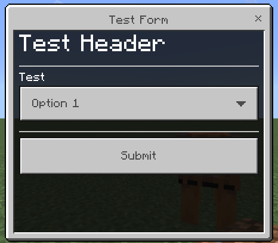
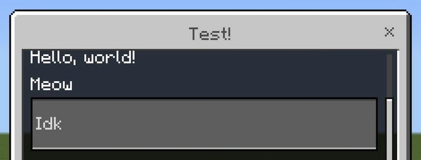
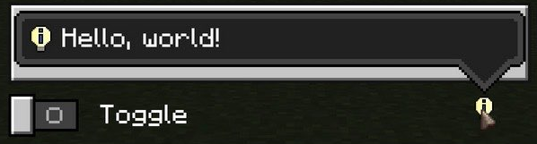

[**Script API - v1.26.0**](../../../README.md)

***

[Script API - v1.26.0](../../../packages.md) / [@minecraft/server-ui](../README.md) / ModalFormData

# Class: ModalFormData

Used to create a fully customizable pop-up form for a
player.

## Example

```typescript
import { world, DimensionLocation } from "@minecraft/server";
import { ModalFormData } from "@minecraft/server-ui";

function showBasicModalForm(log: (message: string, status?: number) => void, targetLocation: DimensionLocation) {
  const players = world.getPlayers();

  const modalForm = new ModalFormData().title("Example Modal Controls for §o§7ModalFormData§r");

  modalForm.toggle("Toggle w/o default");
  modalForm.toggle("Toggle w/ default", true);

  modalForm.slider("Slider w/o default", 0, 50, 5);
  modalForm.slider("Slider w/ default", 0, 50, 5, 30);

  modalForm.dropdown("Dropdown w/o default", ["option 1", "option 2", "option 3"]);
  modalForm.dropdown("Dropdown w/ default", ["option 1", "option 2", "option 3"], 2);

  modalForm.textField("Input w/o default", "type text here");
  modalForm.textField("Input w/ default", "type text here", "this is default");

  modalForm
    .show(players[0])
    .then((formData) => {
      players[0].sendMessage(`Modal form results: ${JSON.stringify(formData.formValues, undefined, 2)}`);
    })
    .catch((error: Error) => {
      log("Failed to show form: " + error);
      return -1;
    });
}
```

## Example: Effect Generator Form


### Example Code (v2)

```js
import { Player, world } from "@minecraft/server";
import { ModalFormData } from "@minecraft/server-ui";
let form = new ModalFormData();
let effectList = [
  { name: "Regeneration", id: "minecraft:regeneration" },
  { name: "Resistance", id: "minecraft:resistance" },
  { name: "Fire Resistance", id: "minecraft:fire_resistance" },
  { name: "Poison", id: "minecraft:poison" },
];
form.title("Effect Generator");
form.textField("Target", "Target of Effect");
form.dropdown(
  "Effect Type",
  effectList.map((effect) => effect.name)
);
form.slider("Effect Level", 0, 255, {
  defaultValue: 1,
  tooltip: "Level of the effect",
  valueStep: 1,
});
form.toggle("Hide Effect Particle", {
  defaultValue: true,
  tooltip: "Toggle to hide/show effect particles",
});
for (const player of world.getAllPlayers()) {
  form.show(player).then((response) => {
    if (response.canceled) {
      player.sendMessage("Canceled due to " + response.cancelationReason);
    } else {
      const [targetName, dropdownValue, effectLevel, hideParticles] =
        response.formValues;
      if (
        typeof dropdownValue !== "string" ||
        typeof dropdownValue !== "number" ||
        typeof effectLevel !== "number" ||
        typeof hideParticles !== "boolean"
      )
        return player.sendMessage("Cannot process form result.");
      const target = world
        .getAllPlayers()
        .find((player) => player.name === targetName);
      if (!(target instanceof Player))
        return player.sendMessage("Target does not exist.");
      target.addEffect(effectList[dropdownValue].id, 50, {
        amplifier: effectLevel,
        showParticles: !hideParticles,
      });
    }
  });
}
```

### Example Code (v1)

```js
import { Player, world } from "@minecraft/server";
import { ModalFormData } from "@minecraft/server-ui";
let form = new ModalFormData();
let effectList = [
  { name: "Regeneration", id: "minecraft:regeneration" },
  { name: "Resistance", id: "minecraft:resistance" },
  { name: "Fire Resistance", id: "minecraft:fire_resistance" },
  { name: "Poison", id: "minecraft:poison" },
];
form.title("Effect Generator");
form.textField("Target", "Target of Effect");
form.dropdown(
  "Effect Type",
  effectList.map((effect) => effect.name)
);
form.slider("Effect Level", 0, 255, 1);
form.toggle("Hide Effect Particle", true);
for (const player of world.getAllPlayers()) {
  form.show(player).then((response) => {
    if (response.canceled) {
      player.sendMessage("Canceled due to " + response.cancelationReason);
    } else {
      const [targetName, dropdownValue, effectLevel, hideParticles] =
        response.formValues;
      if (
        typeof dropdownValue !== "string" ||
        typeof dropdownValue !== "number" ||
        typeof effectLevel !== "number" ||
        typeof hideParticles !== "boolean"
      )
        return player.sendMessage("Cannot process form result.");
      const target = world
        .getAllPlayers()
        .find((player) => player.name === targetName);
      if (!(target instanceof Player))
        return player.sendMessage("Target does not exist.");
      target.addEffect(effectList[dropdownValue].id, 50, {
        amplifier: effectLevel,
        showParticles: !hideParticles,
      });
    }
  });
}
```

**Modal Form v2.0.0-beta features**

@minecraft/server-ui v2.0.0-beta module currently adds [headers](https://jaylydev.github.io/scriptapi-docs/preview/classes/_minecraft_server-ui.ModalFormData-1.html#header), [dividers](https://jaylydev.github.io/scriptapi-docs/preview/classes/_minecraft_server-ui.ModalFormData-1.html#divider), [labels](https://jaylydev.github.io/scriptapi-docs/preview/classes/_minecraft_server-ui.ModalFormData-1.html#label) and more. The following images demostrates those features (subject to change).



> Image from [xKingDark](https://github.com/DarkGamerYT)

## Constructors

### Constructor

> **new ModalFormData**(): `ModalFormData`

#### Returns

`ModalFormData`

## Methods

### divider()

> **divider**(): `ModalFormData`

#### Returns

`ModalFormData`

#### Remarks

Adds a section divider to the form.

#### World Ready

This function can't be called in early-execution mode.

***

### dropdown()

> **dropdown**(`label`, `items`, `dropdownOptions?`): `ModalFormData`

#### Parameters

##### label

`string` \| [`RawMessage`](../../server/interfaces/RawMessage.md)

The label to display for the dropdown.

##### items

(`string` \| [`RawMessage`](../../server/interfaces/RawMessage.md))[]

The selectable items for the dropdown.

##### dropdownOptions?

[`ModalFormDataDropdownOptions`](../interfaces/ModalFormDataDropdownOptions.md)

The optional additional values for the dropdown creation.

#### Returns

`ModalFormData`

#### Remarks

Adds a dropdown with choices to the form.

#### World Ready

This function can't be called in early-execution mode.

***

### header()

> **header**(`text`): `ModalFormData`

#### Parameters

##### text

`string` \| [`RawMessage`](../../server/interfaces/RawMessage.md)

Text to display.

#### Returns

`ModalFormData`

#### Remarks

Adds a header to the form.

#### World Ready

This function can't be called in early-execution mode.

***

### label()

> **label**(`text`): `ModalFormData`

#### Parameters

##### text

`string` \| [`RawMessage`](../../server/interfaces/RawMessage.md)

Text to display.

#### Returns

`ModalFormData`

#### Remarks

Adds a label to the form.

#### World Ready

This function can't be called in early-execution mode.

The image below is a demo of a label that says 'Hello, world!' in form.



> Image from [xKingDark](https://github.com/DarkGamerYT)

***

### show()

> **show**(`player`): `Promise`\<[`ModalFormResponse`](ModalFormResponse.md)\>

#### Parameters

##### player

[`Player`](../../server/classes/Player.md)

Player to show this dialog to.

#### Returns

`Promise`\<[`ModalFormResponse`](ModalFormResponse.md)\>

#### Remarks

Creates and shows this modal popup form. Returns
asynchronously when the player confirms or cancels the
dialog.

#### Write Privilege

This function can't be called in read-only mode.

#### Throws

This function can throw errors.

[minecraftcommon.EngineError](../../common/classes/EngineError.md)

[minecraftserver.InvalidEntityError](../../server/classes/InvalidEntityError.md)

[minecraftserver.RawMessageError](../../server/classes/RawMessageError.md)

#### World Ready

This function can't be called in early-execution mode.

***

### slider()

> **slider**(`label`, `minimumValue`, `maximumValue`, `sliderOptions?`): `ModalFormData`

#### Parameters

##### label

`string` \| [`RawMessage`](../../server/interfaces/RawMessage.md)

The label to display for the slider.

##### minimumValue

`number`

The minimum selectable possible value.

##### maximumValue

`number`

The maximum selectable possible value.

##### sliderOptions?

[`ModalFormDataSliderOptions`](../interfaces/ModalFormDataSliderOptions.md)

The optional additional values for the slider creation.

#### Returns

`ModalFormData`

#### Remarks

Adds a numeric slider to the form.

#### World Ready

This function can't be called in early-execution mode.

***

### submitButton()

> **submitButton**(`submitButtonText`): `ModalFormData`

#### Parameters

##### submitButtonText

`string` \| [`RawMessage`](../../server/interfaces/RawMessage.md)

#### Returns

`ModalFormData`

***

### textField()

> **textField**(`label`, `placeholderText`, `textFieldOptions?`): `ModalFormData`

#### Parameters

##### label

`string` \| [`RawMessage`](../../server/interfaces/RawMessage.md)

The label to display for the textfield.

##### placeholderText

`string` \| [`RawMessage`](../../server/interfaces/RawMessage.md)

The place holder text to display.

##### textFieldOptions?

[`ModalFormDataTextFieldOptions`](../interfaces/ModalFormDataTextFieldOptions.md)

The optional additional values for the textfield creation.

#### Returns

`ModalFormData`

#### Remarks

Adds a textbox to the form.

#### World Ready

This function can't be called in early-execution mode.

***

### title()

> **title**(`titleText`): `ModalFormData`

#### Parameters

##### titleText

`string` \| [`RawMessage`](../../server/interfaces/RawMessage.md)

#### Returns

`ModalFormData`

#### Remarks

This builder method sets the title for the modal dialog.

#### World Ready

This function can't be called in early-execution mode.

***

### toggle()

> **toggle**(`label`, `toggleOptions?`): `ModalFormData`

#### Parameters

##### label

`string` \| [`RawMessage`](../../server/interfaces/RawMessage.md)

The label to display for the toggle.

##### toggleOptions?

[`ModalFormDataToggleOptions`](../interfaces/ModalFormDataToggleOptions.md)

The optional additional values for the toggle creation.

#### Returns

`ModalFormData`

#### Remarks

Adds a toggle checkbox button to the form.

#### World Ready

This function can't be called in early-execution mode.



> Image from [xKingDark](https://github.com/DarkGamerYT)
