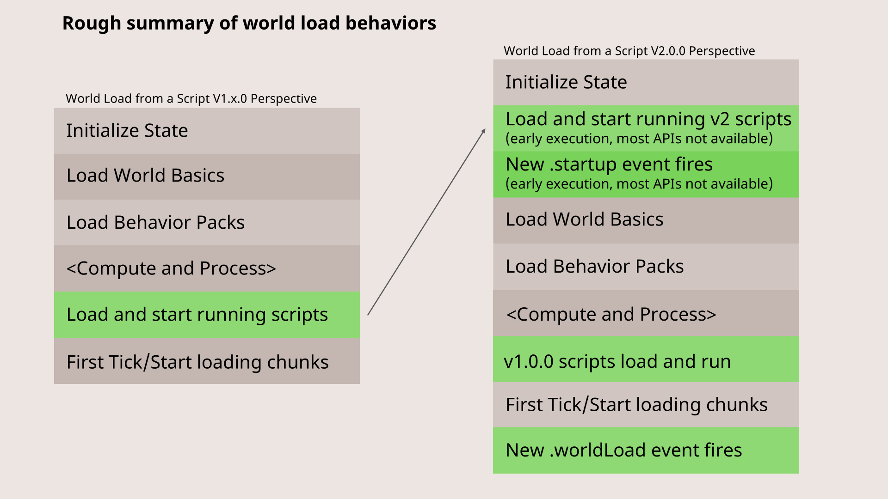

[**Script API - v1.26.0**](../../../README.md)

***

[Script API - v1.26.0](../../../packages.md) / [@minecraft/server](../README-1.md) / WorldAfterEvents

# Class: WorldAfterEvents

Contains a set of events that are available across the scope
of the World.

## Constructors

### Constructor

> `private` **new WorldAfterEvents**(): `WorldAfterEvents`

#### Returns

`WorldAfterEvents`

## Properties

### blockExplode

> `readonly` **blockExplode**: [`BlockExplodeAfterEventSignal`](BlockExplodeAfterEventSignal-1.md)

#### Remarks

This event fires for each BlockLocation destroyed by an
explosion. It is fired after the blocks have already been
destroyed.

This property can be read in early-execution mode.

#### Example

```ts
import { world, BlockExplodeAfterEvent } from "@minecraft/server";

world.afterEvents.blockExplode.subscribe((event: BlockExplodeAfterEvent) => {
console.log("Block:", event.block);
console.log("Dimension:", event.dimension);
console.log("Exploded Block Permutation:", event.explodedBlockPermutation);
console.log("Source:", event.source);

// set block back
event.block.setPermutation(event.explodedBlockPermutation);
});
```

***

### buttonPush

> `readonly` **buttonPush**: [`ButtonPushAfterEventSignal`](ButtonPushAfterEventSignal-1.md)

#### Remarks

This event fires when a button is pushed.

This property can be read in early-execution mode.

#### Example

```js
import { world } from "@minecraft/server";

world.afterEvents.buttonPush.subscribe((event) => {
const { block, dimension, source } = event;

world.sendMessage(`Button ${block.typeId} pushed by ${source.typeId} in ${dimension.id}`);
});
```

***

### chatSend

> `readonly` **chatSend**: [`ChatSendAfterEventSignal`](ChatSendAfterEventSignal.md)

**`Beta`**

#### Remarks

This event is triggered after a chat message has been
broadcast or sent to players.

This property can be read in early-execution mode.

#### Example

```js
import { WeatherType, system, world } from "@minecraft/server";

const chatObjective = world.scoreboard.getObjective("chat") ?? world.scoreboard.addObjective("chat", "chat");

world.afterEvents.chatSend.subscribe((event) => {
const { sender } = event;

const score = chatObjective.hasParticipant(sender) ? chatObjective.getScore(sender.scoreboardIdentity) : 0;
chatObjective.setScore(sender, score + 1);
});
```

***

### dataDrivenEntityTrigger

> `readonly` **dataDrivenEntityTrigger**: [`DataDrivenEntityTriggerAfterEventSignal`](DataDrivenEntityTriggerAfterEventSignal-1.md)

#### Remarks

This event is fired when an entity event has been triggered
that will update the component definition state of an
entity.

This property can be read in early-execution mode.

#### Example

```ts
import { world, system, Entity } from "@minecraft/server";

// Event id to trigger to sheeps
const eventId = "minecraft:entity_spawned";

system.runInterval(() => {
for (let player of world.getAllPlayers()) {
   let [entityRaycaseHit] = player.getEntitiesFromViewDirection({ maxDistance: 150 });
   if (!entityRaycaseHit) continue;
   let entity = entityRaycaseHit.entity;

   if (entity?.typeId === "minecraft:sheep") {
       listenTo(entity);
       entity.triggerEvent(eventId);
   }
}
});

// Detect component groups that are added and removed, and other
// entity definition events fired when this event fires.
function listenTo(entity: Entity) {
const callback = world.afterEvents.dataDrivenEntityTrigger.subscribe(
   (data) => {
       world.afterEvents.dataDrivenEntityTrigger.unsubscribe(callback);

       data.getModifiers().forEach((modifier) => {
           console.log("ComponentGroupsToAdd:", modifier.addedComponentGroups);
           console.log("ComponentGroupsToRemove:", modifier.removedComponentGroups);
           console.log("Triggers:", modifier.triggers);
       });
   },
   { entities: [entity], eventTypes: [eventId] }
);
}
```

***

### effectAdd

> `readonly` **effectAdd**: [`EffectAddAfterEventSignal`](EffectAddAfterEventSignal-1.md)

#### Remarks

This event fires when an effect, like poisoning, is added to
an entity.

This property can be read in early-execution mode.

#### Example

```js
import { world } from "@minecraft/server";

world.afterEvents.effectAdd.subscribe(
(event) => {
   const { effect, entity } = event;

   // Send a message about the effect being added
   world.sendMessage(`Effect ${effect.typeId} was added to ${entity.typeId}`);
},
{
   entityTypes: ["minecraft:player"], // Only track effects on players
}
);
```

***

### entityDie

> `readonly` **entityDie**: [`EntityDieAfterEventSignal`](EntityDieAfterEventSignal-1.md)

#### Remarks

This event fires when an entity dies.

This property can be read in early-execution mode.

#### Example

```js
import { world } from "@minecraft/server";

world.afterEvents.entityDie.subscribe((event) => {
world.sendMessage(`${event.deadEntity.typeId} died from ${event.damageSource}!`);
});
```

***

### entityHeal

> `readonly` **entityHeal**: [`EntityHealAfterEventSignal`](EntityHealAfterEventSignal.md)

**`Beta`**

#### Remarks

This property can be read in early-execution mode.

***

### entityHealthChanged

> `readonly` **entityHealthChanged**: [`EntityHealthChangedAfterEventSignal`](EntityHealthChangedAfterEventSignal-1.md)

#### Remarks

This event fires when entity health changes in any degree.

This property can be read in early-execution mode.

#### Example

```js
import { world } from "@minecraft/server";

world.afterEvents.entityHealthChanged.subscribe(
(event) => {
   const { entity, oldValue, newValue } = event;

   // Only show health changes for players
   if (entity.typeId === "minecraft:player") {
       world.sendMessage(`${entity.nameTag} health changed from ${oldValue} to ${newValue}`);
   }
},
{
   entityTypes: ["minecraft:player"],
}
);
```

***

### entityHitBlock

> `readonly` **entityHitBlock**: [`EntityHitBlockAfterEventSignal`](EntityHitBlockAfterEventSignal-1.md)

#### Remarks

This event fires when an entity hits (that is, melee
attacks) a block.

This property can be read in early-execution mode.

#### Example

```js
import { world } from "@minecraft/server";

// Subscribes to the entityHitBlock event, triggering when an entity collides with a block.
world.afterEvents.entityHitBlock.subscribe((event) => {
const {
   damagingEntity, // The entity that hit the block.
   hitBlock, // The block that was hit.
   hitBlockPermutation,
} = event;

world.sendMessage(
   `${damagingEntity.typeId} hit a ${hitBlockPermutation.type.id} at ${hitBlock.location.x}, ${hitBlock.location.y}, ${hitBlock.location.z}`
);
});
```

***

### entityHitEntity

> `readonly` **entityHitEntity**: [`EntityHitEntityAfterEventSignal`](EntityHitEntityAfterEventSignal-1.md)

#### Remarks

This event fires when an entity hits (that is, melee
attacks) another entity.

This property can be read in early-execution mode.

#### Example

```js
import { world } from "@minecraft/server";
world.afterEvents.entityHitBlock.subscribe((event) => {
const location1 = event.damagingEntity.location;
const location2 = event.hitBlock.location;

const distance = Math.pow(
   Math.pow(location2.x - location1.x, 2) +
       Math.pow(location2.y - location1.y, 2) +
       Math.pow(location2.z - location1.z, 2),
   0.5
);

console.log("Distance: " + distance + " blocks");
});
```

***

### entityHurt

> `readonly` **entityHurt**: [`EntityHurtAfterEventSignal`](EntityHurtAfterEventSignal-1.md)

#### Remarks

This event fires when an entity is hurt (takes damage).

This property can be read in early-execution mode.

#### Example

```js
import { Player, world } from "@minecraft/server";
world.afterEvents.entityHurt.subscribe((event) => {
if (event.hurtEntity instanceof Player) {
   event.hurtEntity.sendMessage("You were hurt from " + event.damageSource.cause + "!");
}
});
```

***

### entityItemDrop

> `readonly` **entityItemDrop**: [`EntityItemDropAfterEventSignal`](EntityItemDropAfterEventSignal.md)

**`Beta`**

#### Remarks

This event fires when an entity drops items.

This property can be read in early-execution mode.

***

### entityItemPickup

> `readonly` **entityItemPickup**: [`EntityItemPickupAfterEventSignal`](EntityItemPickupAfterEventSignal.md)

**`Beta`**

#### Remarks

This event fires when an entity picks up items.

This property can be read in early-execution mode.

***

### entityLoad

> `readonly` **entityLoad**: [`EntityLoadAfterEventSignal`](EntityLoadAfterEventSignal-1.md)

#### Remarks

Fires when an entity is loaded.

This property can be read in early-execution mode.

#### Example

```ts
import { world } from "@minecraft/server";

// Subscribe to the EntityLoadAfterEvent
const entityLoadSubscription = world.afterEvents.entityLoad.subscribe((event) => {
// Handle the entity load event
world.sendMessage(`Entity loaded: ${event.entity.typeId}`);
// Unsubscribe so the message doesn't appear after fired
world.afterEvents.entityLoad.unsubscribe(entityLoadSubscription);
});
```

***

### entityRemove

> `readonly` **entityRemove**: [`EntityRemoveAfterEventSignal`](EntityRemoveAfterEventSignal-1.md)

#### Remarks

Fires when an entity is removed (for example, potentially
unloaded, or removed after being killed).

This property can be read in early-execution mode.

#### Example

```js
import { system, world } from "@minecraft/server";

// Subscribe to the entityRemove event, which is triggered when an entity is removed from the world
world.afterEvents.entityRemove.subscribe((eventData) => {
// Extract the type ID of the removed entity from the event data
const { typeId } = eventData;

// Send a message to all players in the world indicating that an entity of the given type has been removed
world.sendMessage(`Entity ${typeId} got removed`);
});

/*
Explanation:
This script listens for the `entityRemove` event, which occurs when an entity is removed from the Minecraft world.

- **Event Subscription**: 
The `world.afterEvents.entityRemove.subscribe` method registers a callback function to handle the event whenever an entity is removed.

- **Extracting Entity Type**:
The `typeId` property from the `eventData` object contains the identifier of the removed entity's type.

- **Sending a Message**:
The script constructs a message indicating which type of entity was removed and sends this message to all players in the world using `world.sendMessage`.

Usage:
When an entity is removed (e.g., due to despawning, being killed, or otherwise removed), this script will automatically notify all players in the game with a message stating the type of the removed entity.
/
```

***

### entitySpawn

> `readonly` **entitySpawn**: [`EntitySpawnAfterEventSignal`](EntitySpawnAfterEventSignal-1.md)

#### Remarks

This event fires when an entity is spawned.

This property can be read in early-execution mode.

#### Example

```js
import { world } from "@minecraft/server";

// Subscribe to entitySpawn event, so it sends a message when an entity is spawn into a world.
world.afterEvents.entitySpawn.subscribe((event) => {
const { entity } = event;

// Sends a message to world.
world.sendMessage(`${entity.typeId} is spawned`);
});
```

***

### explosion

> `readonly` **explosion**: [`ExplosionAfterEventSignal`](ExplosionAfterEventSignal-1.md)

#### Remarks

This event is fired after an explosion occurs.

This property can be read in early-execution mode.

#### Example

```ts
import { world } from "@minecraft/server";

// Subscribe to the ExplosionAfterEvent
const explosionSubscription = world.afterEvents.explosion.subscribe((event) => {
console.log(`Explosion occurred in dimension ${event.dimension.id}`);

if (event.source) {
   console.log(`Explosion source: ${event.source.typeId}`);
} else {
   console.log(`Explosion source: None`);
}

const impactedBlocks = event.getImpactedBlocks();
console.log(`Impacted blocks: ${JSON.stringify(impactedBlocks)}`);
});

// ... Later in your code, when you want to unsubscribe
world.afterEvents.explosion.unsubscribe(explosionSubscription);
```

***

### gameRuleChange

> `readonly` **gameRuleChange**: [`GameRuleChangeAfterEventSignal`](GameRuleChangeAfterEventSignal-1.md)

#### Remarks

This event fires when a world.gameRules property has
changed.

This property can be read in early-execution mode.

#### Example

```js
import { world } from "@minecraft/server";

// Subscribe to the gameRuleChange event, which is triggered when a game rule is updated
world.afterEvents.gameRuleChange.subscribe((eventData) => {
// Extract the game rule name and its new value from the event data
const { rule, value } = eventData;

// Send a message to all players in the world indicating that a game rule has been updated
world.sendMessage(`Gamerule ${rule} updated to ${value}`);
});

/*
Explanation:
This script listens for the `gameRuleChange` event, which occurs when a game rule is modified in Minecraft.

- **Event Subscription**:
The `world.afterEvents.gameRuleChange.subscribe` method registers a callback function to handle the event whenever a game rule changes.

- **Extracting Information**:
- `rule` provides the name of the game rule that was changed.
- `value` indicates the new value of the game rule.

- **Sending Notification**:
- The script constructs a message that includes the name of the updated game rule and its new value, then sends this message to all players in the world using `world.sendMessage`.

Usage:
When a game rule is changed, this script automatically notifies all players with a message that includes the name of the updated game rule and its new value. This is useful for tracking changes to game rules and keeping players informed about the current game settings.
/
```

***

### itemCompleteUse

> `readonly` **itemCompleteUse**: [`ItemCompleteUseAfterEventSignal`](ItemCompleteUseAfterEventSignal-1.md)

#### Remarks

This event fires when a chargeable item completes charging.

This property can be read in early-execution mode.

#### Example

```js
import { world } from "@minecraft/server";

// Subscribe to the itemCompleteUse event, which is triggered when a player completes using an item
world.afterEvents.itemCompleteUse.subscribe((eventData) => {
// Extract the player who used the item and the item stack from the event data
const { source, itemStack } = eventData;

// Construct a message indicating the player's name and the type of item they used
world.sendMessage(`Player ${source.nameTag} completed use of item (${itemStack.typeId})`);
});

/*
Explanation:
This script listens for the `itemCompleteUse` event, which occurs when a player finishes using an item in Minecraft.

- **Event Subscription**:
The `world.afterEvents.itemCompleteUse.subscribe` method registers a callback function to handle the event whenever an item use is completed.

- **Extracting Information**:
- `source` represents the player who used the item.
- `itemStack` provides details about the item stack, including its type ID.

- **Sending Notification**:
- The script constructs a message that includes the player's name and the type ID of the item they used. This message is then sent to all players in the world using `world.sendMessage`.

Usage:
When a player completes using an item (such as consuming a potion or using a tool), this script sends a notification to all players in the game, indicating which player used which item. This can be useful for tracking item usage or for general game management.
/
```

***

### itemReleaseUse

> `readonly` **itemReleaseUse**: [`ItemReleaseUseAfterEventSignal`](ItemReleaseUseAfterEventSignal-1.md)

#### Remarks

This event fires when a chargeable item is released from
charging.

This property can be read in early-execution mode.

#### Example

```js
import { world } from "@minecraft/server";

// Subscribe to the `itemReleaseUse` event, which is triggered when a player releases the use of an item
world.afterEvents.itemReleaseUse.subscribe((eventData) => {
const { source, itemStack } = eventData;

world.sendMessage(`${source.nameTag} released the use of item ${itemStack.typeId}`);
});
```

***

### itemStartUse

> `readonly` **itemStartUse**: [`ItemStartUseAfterEventSignal`](ItemStartUseAfterEventSignal-1.md)

#### Remarks

This event fires when a chargeable item starts charging.

This property can be read in early-execution mode.

#### Example

```js
import { world } from "@minecraft/server";

// Subscribe to the `itemStartUse` event, which is triggered when a player starts using an item
world.afterEvents.itemStartUse.subscribe((eventData) => {
const { source, itemStack } = eventData;

world.sendMessage(`${source.nameTag} started using item ${itemStack.typeId}`);
});
```

***

### itemStartUseOn

> `readonly` **itemStartUseOn**: [`ItemStartUseOnAfterEventSignal`](ItemStartUseOnAfterEventSignal-1.md)

#### Remarks

This event fires when a player successfully uses an item or
places a block by pressing the Use Item / Place Block
button. If multiple blocks are placed, this event will only
occur once at the beginning of the block placement. Note:
This event cannot be used with Hoe or Axe items.

This property can be read in early-execution mode.

#### Example

```js
import { world } from "@minecraft/server";

// Subscribe to the `itemStartUseOn` event, which is triggered when a player starts using an item on a block
world.afterEvents.itemStartUseOn.subscribe((eventData) => {
const { source, block, itemStack } = eventData;
const { x, y, z } = block.location;

world.sendMessage(`${source.nameTag} started using item ${itemStack.typeId} on block at ${x}, ${y}, ${z}`);
});
```

***

### itemStopUse

> `readonly` **itemStopUse**: [`ItemStopUseAfterEventSignal`](ItemStopUseAfterEventSignal-1.md)

#### Remarks

This event fires when a chargeable item stops charging.

This property can be read in early-execution mode.

#### Example

```js
import { world } from "@minecraft/server";

// Subscribe to the `itemStopUse` event, which is triggered when a player stops using an item
world.afterEvents.itemStopUse.subscribe((eventData) => {
const { source, itemStack } = eventData;

world.sendMessage(`${source.nameTag} stopped using item ${itemStack.typeId}`);
});
```

***

### itemStopUseOn

> `readonly` **itemStopUseOn**: [`ItemStopUseOnAfterEventSignal`](ItemStopUseOnAfterEventSignal-1.md)

#### Remarks

This event fires when a player releases the Use Item / Place
Block button after successfully using an item. Note: This
event cannot be used with Hoe or Axe items.

This property can be read in early-execution mode.

#### Example

```js
import { world } from "@minecraft/server";

// Subscribe to the `itemStopUseOn` event, which is triggered when a player stops using an item on a block
world.afterEvents.itemStopUseOn.subscribe((eventData) => {
const { source, block, itemStack } = eventData;
const { x, y, z } = block.location;

world.sendMessage(`${source.nameTag} stopped using item ${itemStack.typeId} on block at ${x}, ${y}, ${z}`);
});
```

***

### itemUse

> `readonly` **itemUse**: [`ItemUseAfterEventSignal`](ItemUseAfterEventSignal-1.md)

#### Remarks

This event fires when an item is successfully used by a
player.

This property can be read in early-execution mode.

#### Example

```js
import { world } from "@minecraft/server";

// Subscribe to the itemUse event
world.afterEvents.itemUse.subscribe((eventData) => {
const { source, itemStack } = eventData;

world.sendMessage(`${source.name} used item ${itemStack.typeId}`);
});
```

***

### leverAction

> `readonly` **leverAction**: [`LeverActionAfterEventSignal`](LeverActionAfterEventSignal-1.md)

#### Remarks

A lever has been pulled.

This property can be read in early-execution mode.

#### Example

```js
// Script by WavePlayz

import { world } from "@minecraft/server";

// Subscribe to the `leverAction` event, which is triggered when a player interacts with a lever
world.afterEvents.leverAction.subscribe((eventData) => {
const { player, block, isPowered } = eventData;
const { x, y, z } = block.location;

world.sendMessage(`${player.name} toggled a lever at ${x}, ${y}, ${z}. Lever is now ${isPowered ? "ON" : "OFF"}`);
});
```
Example: Subscribe to the `leverAction` event, which is triggered when a player interacts with a lever.

```js
// Script by WavePlayz

import { world } from "@minecraft/server";

world.afterEvents.leverAction.subscribe(eventData => {
    const { source, block, powered } = eventData;
    const { x, y, z } = block.location;
    
    world.sendMessage(`${source.name} toggled a lever at ${x}, ${y}, ${z}. Lever is now ${powered ? "ON" : "OFF"}`);
});
```

***

### messageReceive

> `readonly` **messageReceive**: [`ServerMessageAfterEventSignal`](ServerMessageAfterEventSignal.md)

**`Beta`**

#### Remarks

This event is an internal implementation detail, and is
otherwise not currently functional.

This property can be read in early-execution mode.

***

### packSettingChange

> `readonly` **packSettingChange**: [`PackSettingChangeAfterEventSignal`](PackSettingChangeAfterEventSignal.md)

**`Beta`**

#### Remarks

This event is triggered when a pack setting is changed.

This property can be read in early-execution mode.

***

### pistonActivate

> `readonly` **pistonActivate**: [`PistonActivateAfterEventSignal`](PistonActivateAfterEventSignal-1.md)

#### Remarks

This event fires when a piston expands or retracts.

This property can be read in early-execution mode.

#### Example

```js
import { world } from "@minecraft/server";

// Subscribe to the `pistonActivate` event, which is triggered when a piston extends or retracts
world.afterEvents.pistonActivate.subscribe((eventData) => {
const { block, isExpanding } = eventData;
const { x, y, z } = block.location;

world.sendMessage(`Piston at ${x}, ${y}, ${z} is ${isExpanding ? "extending" : "retracting"}`);
});
```

***

### playerBreakBlock

> `readonly` **playerBreakBlock**: [`PlayerBreakBlockAfterEventSignal`](PlayerBreakBlockAfterEventSignal-1.md)

#### Remarks

This event fires for a block that is broken by a player.

This property can be read in early-execution mode.

#### Example

```js
import { world } from "@minecraft/server";

world.afterEvents.playerBreakBlock.subscribe((event) => {
const { brokenBlockPermutation, player } = event;

if (brokenBlockPermutation.type.id === "minecraft:grass") {
   player.sendMessage("You broke a grass block!");
}

if (brokenBlockPermutation.type.id === "minecraft:stone") {
   player.sendMessage("You broke a stone block!");
}
});
```

***

### playerButtonInput

> `readonly` **playerButtonInput**: [`PlayerButtonInputAfterEventSignal`](PlayerButtonInputAfterEventSignal-1.md)

#### Remarks

This event fires when an [InputButton](../enumerations/InputButton-1.md) state is
changed.

This property can be read in early-execution mode.

***

### playerDimensionChange

> `readonly` **playerDimensionChange**: [`PlayerDimensionChangeAfterEventSignal`](PlayerDimensionChangeAfterEventSignal-1.md)

#### Remarks

Fires when a player moved to a different dimension.

This property can be read in early-execution mode.

#### Example

```js
import { world } from "@minecraft/server";

// Subscribe to the `playerDimensionChange` event, which is triggered when a player changes dimensions
world.afterEvents.playerDimensionChange.subscribe((eventData) => {
const { player, fromDimension, toDimension } = eventData;

world.sendMessage(`${player.name} moved from ${fromDimension.id} to ${toDimension.id}`);
});
```

***

### playerEmote

> `readonly` **playerEmote**: [`PlayerEmoteAfterEventSignal`](PlayerEmoteAfterEventSignal-1.md)

#### Remarks

This property can be read in early-execution mode.

#### Example

```js
import { world } from "@minecraft/server";

// Subscribe to the `playerEmote` event, which is triggered when a player performs an emote
world.afterEvents.playerEmote.subscribe((eventData) => {
const { player, personaPieceId } = eventData;

world.sendMessage(`${player.name} performed emote ${personaPieceId}`);
});
```

***

### playerGameModeChange

> `readonly` **playerGameModeChange**: [`PlayerGameModeChangeAfterEventSignal`](PlayerGameModeChangeAfterEventSignal-1.md)

#### Remarks

This property can be read in early-execution mode.

#### Example

```js
import { world } from "@minecraft/server";

// Subscribe to the `playerGameModeChange` event, which is triggered when a player changes their game mode
world.afterEvents.playerGameModeChange.subscribe((eventData) => {
const { player, toGameMode } = eventData;

world.sendMessage(`${player.name} changed game mode to ${toGameMode}`);
});
```

***

### playerHotbarSelectedSlotChange

> `readonly` **playerHotbarSelectedSlotChange**: [`PlayerHotbarSelectedSlotChangeAfterEventSignal`](PlayerHotbarSelectedSlotChangeAfterEventSignal-1.md)

#### Remarks

This event fires when a player's selected slot changes.

This property can be read in early-execution mode.

***

### playerInputModeChange

> `readonly` **playerInputModeChange**: [`PlayerInputModeChangeAfterEventSignal`](PlayerInputModeChangeAfterEventSignal-1.md)

#### Remarks

This event fires when a player's [InputMode](../enumerations/InputMode-1.md) changes.

This property can be read in early-execution mode.

***

### playerInputPermissionCategoryChange

> `readonly` **playerInputPermissionCategoryChange**: [`PlayerInputPermissionCategoryChangeAfterEventSignal`](PlayerInputPermissionCategoryChangeAfterEventSignal-1.md)

#### Remarks

This event fires when a players input permissions change.

This property can be read in early-execution mode.

#### Example

```js
import { world } from "@minecraft/server";

// Subscribe to the `playerInputPermissionCategoryChange` event, which is triggered when a player's input permissions change
world.afterEvents.playerInputPermissionCategoryChange.subscribe((eventData) => {
const { player, category, enabled } = eventData;

world.sendMessage(`${player.name} ${enabled ? "enabled" : "disabled"} input permission category ${category}`);
});
```

***

### playerInteractWithBlock

> `readonly` **playerInteractWithBlock**: [`PlayerInteractWithBlockAfterEventSignal`](PlayerInteractWithBlockAfterEventSignal-1.md)

#### Remarks

An event for when a player interacts with a block.

This property can be read in early-execution mode.

#### Example

```js
import { world } from "@minecraft/server";

// Subscribe to the `playerInteractWithBlock` event, which is triggered when a player interacts with a block
world.afterEvents.playerInteractWithBlock.subscribe((eventData) => {
const { player, block } = eventData;
const { x, y, z } = block.location;

world.sendMessage(`${player.name} interacted with block at ${x}, ${y}, ${z}`);
});
```

***

### playerInteractWithEntity

> `readonly` **playerInteractWithEntity**: [`PlayerInteractWithEntityAfterEventSignal`](PlayerInteractWithEntityAfterEventSignal-1.md)

#### Remarks

This event fires when a player interacts with an entity.

This property can be read in early-execution mode.

#### Example

```js
import { world } from "@minecraft/server";

// Subscribe to the `playerInteractWithEntity` event, which is triggered when a player interacts with an entity
world.afterEvents.playerInteractWithEntity.subscribe((eventData) => {
const { player, target, beforeItemStack, itemStack } = eventData;
const { x, y, z } = target.location;

if (!itemStack && !beforeItemStack) {
   world.sendMessage(`${player.name} interacted with entity at ${x}, ${y}, ${z}`);
} else {
   world.sendMessage(
       `${player.name} interacted with entity at ${x}, ${y}, ${z} with ${beforeItemStack.typeId} (now ${itemStack.typeId})`
   );
}
});
```

***

### playerInventoryItemChange

> `readonly` **playerInventoryItemChange**: [`PlayerInventoryItemChangeAfterEventSignal`](PlayerInventoryItemChangeAfterEventSignal-1.md)

#### Remarks

This event fires when an item gets added or removed to the
player's inventory.

This property can be read in early-execution mode.

***

### playerJoin

> `readonly` **playerJoin**: [`PlayerJoinAfterEventSignal`](PlayerJoinAfterEventSignal-1.md)

#### Remarks

This event fires when a player joins a world.  See also
playerSpawn for another related event you can trap for when
a player is spawned the first time within a world.

This property can be read in early-execution mode.

#### Example

```js
import { world } from "@minecraft/server";
world.afterEvents.playerJoin.subscribe(({ playerId, playerName }) => {
world.sendMessage(`Player ${playerName} (${playerId}) has just joined the world.`);
});
```

***

### playerLeave

> `readonly` **playerLeave**: [`PlayerLeaveAfterEventSignal`](PlayerLeaveAfterEventSignal-1.md)

#### Remarks

This event fires when a player leaves a world.

This property can be read in early-execution mode.

#### Example

```js
import { world } from "@minecraft/server";
world.afterEvents.playerLeave.subscribe(({ playerId, playerName }) => {
world.sendMessage(`Player ${playerName} (${playerId}) has just left the world.`);
});
```

***

### playerPlaceBlock

> `readonly` **playerPlaceBlock**: [`PlayerPlaceBlockAfterEventSignal`](PlayerPlaceBlockAfterEventSignal-1.md)

#### Remarks

This event fires for a block that is placed by a player.

This property can be read in early-execution mode.

#### Example

```js
import { world } from "@minecraft/server";

// Subscribe to the `playerPlaceBlock` event, which is triggered when a player places a block
world.afterEvents.playerPlaceBlock.subscribe((eventData) => {
// Destructure the eventData to get the player who placed the block and the block itself
const { player, block } = eventData;

// Extract the x, y, and z coordinates from the block's location
const { x, y, z } = block.location;

// Format the coordinates as a string
const coordinates = `${x}, ${y}, ${z}`;

// Construct a message indicating which player placed which block and where
const message = `${player.name} placed ${block.typeId} at location ${coordinates}`;

// Send the message to all players in the world
world.sendMessage(message);
});
```

***

### playerSpawn

> `readonly` **playerSpawn**: [`PlayerSpawnAfterEventSignal`](PlayerSpawnAfterEventSignal-1.md)

#### Remarks

This event fires when a player spawns or respawns. Note that
an additional flag within this event will tell you whether
the player is spawning right after join vs. a respawn.

This property can be read in early-execution mode.

#### Example

```js
import { world } from "@minecraft/server";

world.afterEvents.playerSpawn.subscribe((eventData) => {
let { player, initialSpawn } = eventData;
if (!initialSpawn) return;

// This runs when the player joins the game for the first time!
});
```

***

### playerSwingStart

> `readonly` **playerSwingStart**: [`PlayerSwingStartAfterEventSignal`](PlayerSwingStartAfterEventSignal-1.md)

#### Remarks

This property can be read in early-execution mode.

***

### playerUseNameTag

> `readonly` **playerUseNameTag**: [`PlayerUseNameTagAfterEventSignal`](PlayerUseNameTagAfterEventSignal.md)

**`Beta`**

#### Remarks

An event for when a player uses a named name tag on an
entity.

This property can be read in early-execution mode.

***

### pressurePlatePop

> `readonly` **pressurePlatePop**: [`PressurePlatePopAfterEventSignal`](PressurePlatePopAfterEventSignal-1.md)

#### Remarks

A pressure plate has popped back up (i.e., there are no
entities on the pressure plate.)

This property can be read in early-execution mode.

#### Example

```js
import { world } from "@minecraft/server";

// Subscribe to the `pressurePlatePop` event, which is triggered when a player steps off a pressure plate
world.afterEvents.pressurePlatePop.subscribe((eventData) => {
// Extract the block (pressure plate) that was released
const { block } = eventData;

// Extract the x, y, and z coordinates from the block's location
const { x, y, z } = block.location;

// Format the coordinates as a string
const coordinates = `${x}, ${y}, ${z}`;

// Construct a message indicating that a pressure plate at a specific location was released
const message = `Pressure plate at location ${coordinates} was released`;

// Send the message to all players in the world
world.sendMessage(message);
});
```

***

### pressurePlatePush

> `readonly` **pressurePlatePush**: [`PressurePlatePushAfterEventSignal`](PressurePlatePushAfterEventSignal-1.md)

#### Remarks

A pressure plate has pushed (at least one entity has moved
onto a pressure plate.)

This property can be read in early-execution mode.

#### Example

```js
import { Player, world } from "@minecraft/server";

// Subscribe to the `pressurePlatePush` event, which is triggered when a player steps on a pressure plate
world.afterEvents.pressurePlatePush.subscribe((eventData) => {
// Extract the source entity (the player who stepped on the pressure plate) and the block (pressure plate)
const { source, block } = eventData;

// Extract the x, y, and z coordinates from the block's location
const { x, y, z } = block.location;

// Format the coordinates as a string
const coordinates = `${x}, ${y}, ${z}`;

if (source instanceof Player) {
   // If the source is a player, send a message to the world
   world.sendMessage(`${source.name} stepped on a pressure plate at ${coordinates}`);
} else {
   // If the source is not a player, handle accordingly
   world.sendMessage(`${source.typeId} stepped on a pressure plate at ${coordinates}`);
}
});
```

***

### projectileHitBlock

> `readonly` **projectileHitBlock**: [`ProjectileHitBlockAfterEventSignal`](ProjectileHitBlockAfterEventSignal-1.md)

#### Remarks

This event fires when a projectile hits a block.

This property can be read in early-execution mode.

#### Example

```js
import { Player, world } from "@minecraft/server";

// Subscribe to the `projectileHitBlock` event, which is triggered when a projectile hits a block
world.afterEvents.projectileHitBlock.subscribe((eventData) => {
// Extract the source entity (the one that shot the projectile)
const { source } = eventData;

// Retrieve the block that was hit by the projectile
const hitBlock = eventData.getBlockHit()?.block;

// Check if the hitBlock is valid
if (hitBlock) {
   // Extract the x, y, and z coordinates from the hitBlock's location
   const { x, y, z } = hitBlock.location;

   // Format the coordinates as a string
   const coordinates = `${x}, ${y}, ${z}`;

   if (source instanceof Player) {
       // If the source is a player, send a message to the world
       world.sendMessage(`${source.nameTag} hit the block at ${coordinates}`);
   } else {
       // If the source is not a player, handle accordingly
       world.sendMessage(`${source.typeId} hit the block at ${coordinates}`);
   }
}
});
```

***

### projectileHitEntity

> `readonly` **projectileHitEntity**: [`ProjectileHitEntityAfterEventSignal`](ProjectileHitEntityAfterEventSignal-1.md)

#### Remarks

This event fires when a projectile hits an entity.

This property can be read in early-execution mode.

#### Example

```js
import { Player, world } from "@minecraft/server";

// Subscribe to the `projectileHitEntity` event, which is triggered when a projectile hits an entity
world.afterEvents.projectileHitEntity.subscribe((eventData) => {
// Destructure the eventData to get the source entity (the one that shot the projectile)
const { source } = eventData;

// Get the entity that was hit by the projectile
const hitEntity = eventData.getEntityHit()?.entity;

// Check if the hitEntity is valid
if (hitEntity && source instanceof Player) {
   // Extract the x, y, and z coordinates from the hitEntity's location
   const { x, y, z } = hitEntity.location;

   // Create a string representing the coordinates in the format "x, y, z"
   const coordinates = `${x}, ${y}, ${z}`;

   // Construct a message indicating which player hit which entity and where
   const message = `${source.nameTag} hit the entity at location ${coordinates}`;

   // Send the message to all players in the world
   world.sendMessage(message);

   // Immediately kill the hit entity
   hitEntity.kill();
}
});
```

***

### targetBlockHit

> `readonly` **targetBlockHit**: [`TargetBlockHitAfterEventSignal`](TargetBlockHitAfterEventSignal-1.md)

#### Remarks

A target block was hit.

This property can be read in early-execution mode.

#### Example

```js
import { Player, world } from "@minecraft/server";

// Subscribe to the targetBlockHit event
world.afterEvents.targetBlockHit.subscribe((eventData) => {
const { source, hitVector } = eventData;
const { x, y, z } = hitVector;

if (source instanceof Player) {
   world.sendMessage(`${source.name} hit a target block at ${x.toFixed(1)}, ${y.toFixed(1)}, ${z.toFixed(1)}`);
}
});
```

***

### tripWireTrip

> `readonly` **tripWireTrip**: [`TripWireTripAfterEventSignal`](TripWireTripAfterEventSignal-1.md)

#### Remarks

A trip wire was tripped.

This property can be read in early-execution mode.

#### Example

```js
```

***

### weatherChange

> `readonly` **weatherChange**: [`WeatherChangeAfterEventSignal`](WeatherChangeAfterEventSignal-1.md)

#### Remarks

This event will be triggered when the weather changes within
Minecraft.

This property can be read in early-execution mode.

#### Example

```js
import { world } from "@minecraft/server";

// Subscribe to the weatherChange event
world.afterEvents.weatherChange.subscribe((eventData) => {
const { dimension, previousWeather, newWeather } = eventData;

world.sendMessage(`Weather changed from ${previousWeather} to ${newWeather} in ${dimension}`);
});
```

***

### worldLoad

> `readonly` **worldLoad**: [`WorldLoadAfterEventSignal`](WorldLoadAfterEventSignal-1.md)

#### Remarks

This property can be read in early-execution mode.

#### Examples

```js
import { BlockVolume, world } from "@minecraft/server";

// Runs when world is first loaded.
// Everything inside this callback bypasses the early-execution mode
world.afterEvents.worldLoad.subscribe(() => {
const overworld = world.getDimension("overworld");
const volume = new BlockVolume({ x: 10, y: 0, z: 0 }, { x: 0, y: 10, z: 0 });
overworld.fillBlocks(volume, "minecraft:stone");
});
```

```js
import { world } from "@minecraft/server";

// Subscribe to the worldLoad event, which is triggered when the world is loaded
world.afterEvents.worldLoad.subscribe(() => {
console.warn("World has been loaded. All operations such as world.getPlayers() can be called.");
world.sendMessage("Welcome to the world! Enjoy your stay.");
});
```


> Image from [Microsoft Creator Docs](https://learn.microsoft.com/en-us/minecraft/creator/documents/scriptingv2.0.0overview?view=minecraft-bedrock-stable)

A video verson available of `worldLoad` event walkthrough is available here (timestamp provided):

<iframe width="914" height="514" src="https://www.youtube.com/embed/owfBDnOHI_o?start=86" title="Script API v2.0.0 Beta Overview" frameborder="0" allow="accelerometer; autoplay; clipboard-write; encrypted-media; gyroscope; picture-in-picture; web-share" referrerpolicy="strict-origin-when-cross-origin" allowfullscreen></iframe>
