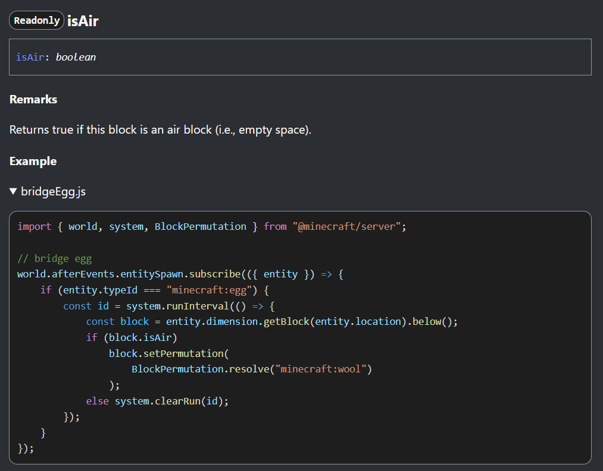

## Jayly's Script API References

Jayly's Script API References is a set of documentation of experimental and stable Script APIs for Minecraft: Bedrock Edition.

Visit https://jaylydev.github.io/scriptapi-docs/ to view the full documentation.

## Docs Folder

The `docs` folder contains guides and technical documentation related to Minecraft's Bedrock Script API. This section of the website is powered by VitePress along with the Script API Docs homepage.

## API Examples

The `examples` folder contains code snippets for usage of script API features, which they're featured in API references generated using [TypeDoc](https://typedoc.org/) within GitHub Pages when deployed.

There are folders with a README file, which indicates that there is a missing example towards that component within  Script API documentation and we encourage you to help us. Check out the [Contribute Page](./examples/README.md) for further instructions.

Example - The `bridgeEgg.js` file saved in `/examples/@minecraft/server/Block/prototype/isAir` folder with the following content:

```js
import { world, system, BlockPermutation } from "@minecraft/server";

// bridge egg
world.afterEvents.entitySpawn.subscribe(({ entity }) => {
    if (entity.typeId === "minecraft:egg") {
      const id = system.runInterval(() => {
        const block = entity.dimension.getBlock(entity.location).below();
        if (block.isAir) block.setPermutation(BlockPermutation.resolve("minecraft:wool"));
        else system.clearRun(id);
      });
    }
});
```

will be in the API reference in this format:



## Build and Test code

Currently the documentation and guides written for the website and the examples for the API references are open sourced only. We may release more stuff here in the future.

## Contributing

Feel free to submit GitHub issues and pull requests for suggestions on improving the Script API examples in the repository. We are working on tools to manage these suggestions and sync changes to our internal repository.

If you want to help contributing this repository or you have some questions, feel free to [Join the Discord](https://discord.gg/SuhGvZEXb4)