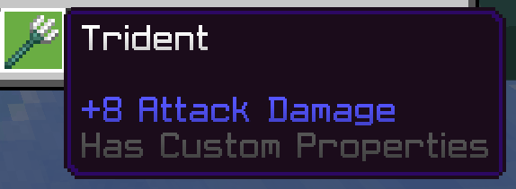

# Dynamic Properties

Dynamic properties allows developers can save and load their own custom properties within a Minecraft world.

This allows data to be saved directly into disk, specifically world's LevelDB, and these values can be retrived after the server stopped and started again next time.

Dynamic properties are tied to a behavior pack's header UUID. Since behavior packs cannot access other behavior packs' dynamic properties, when behavior pack's header UUID gets changed, the pack can no longer retrieve previous data.

## Installation

Requires `@minecraft/server` version `1.7.0` or above.

```json
{
  "module_name": "@minecraft/server",
  "version": "1.7.0"
}
```

## Usage

You can set, get and remove dynamic properties binds to entities or players through `Entity` class, or items through `ContainerSlot` or `ItemStack` class.

If you want to access data without entities or items loaded, you can also store properties bind to the world through the `World` class.

### Set Property (World)

Sets a specified property to a value targeted to world.

Save a string property value:

```ts
import { world } from "@minecraft/server";
world.setDynamicProperty("key", "value");
```

::: warning
There is a length limit of 32,767 bytes for string dynamic properties.
:::

Save a numeric property value:

```ts
import { world } from "@minecraft/server";
world.setDynamicProperty("key", 10);
```

> The numeric value must be a signed 64-bit float, ranging from -9,223,372,036,854,775,808 to 9,223,372,036,854,775,807 (inclusive).

Save a boolean property value:

```ts
import { world } from "@minecraft/server";
world.setDynamicProperty("key", true);
```

Save a Vector3 property value:

```ts
import { world } from "@minecraft/server";
world.setDynamicProperty("key", { x: 10, y: 10, z: 10 });
```

Preview (Structure):

```
DynamicProperties
└───<behavior_pack_header_uuid>
       key: value
```

Details (LevelDB Format):

<table>
<tbody>
<tr>
<td><strong>Key</strong></td> <td><strong>Value (NBT)</strong></td>
</tr>
</tbody>
<tbody>
<tr>
<td>DynamicProperties</td>
<td>

```json
{
  TAG_Compound("<behavior_pack_header_uuid>") {
    TAG_String("key"): value
  }
}
```

</td>
</tr>
</tbody>
</table>

### Set Property (Entity)

Sets a specified property to a value targeted to a specific entity or player.

Get Player instance first:

```ts
import { world } from "@minecraft/server";

const player = world.getPlayers()[0];
```

Save a string property value:

```ts
player.setDynamicProperty("key", "value");
```

::: warning
There is a length limit of 32,767 bytes for string dynamic properties.
:::

Save a numeric property value:

```ts
player.setDynamicProperty("key", 10);
```

> The numeric value must be a signed 64-bit float, ranging from -9,223,372,036,854,775,808 to 9,223,372,036,854,775,807 (inclusive).

Save a boolean property value:

```ts
player.setDynamicProperty("key", true);
```

Save a Vector3 property value:

```ts
player.setDynamicProperty("key", { x: 10, y: 10, z: 10 });
```

Preview (Structure):

```
Player
└───DynamicProperties
    └───<behavior_pack_header_uuid>
            key: value
```

Details (LevelDB Format):

<table>
<tbody>
<tr>
<td><strong>Key</strong></td> <td><strong>Value (NBT)</strong></td>
</tr>
</tbody>
<tbody>
<tr>
<td>&lt;Entity&gt;</td>
<td>

```json
{
  TAG_Compound("DynamicProperties") {
    TAG_Compound("<behavior_pack_header_uuid>") {
      TAG_String("key"): "value"
    }
  }
}
```

</td>
</tr>
</tbody>
</table>

### Set Property (Item)

Sets a specified property to a value targeted to a specific item.

Get ItemStack instance first:

```ts
import { world } from "@minecraft/server";

const player = world.getPlayers()[0];
const inventory = player.getComponent("inventory");
const item = inventory.container.getItem(player.selectedSlotIndex);
```

Save a string property value:

```ts
item.setDynamicProperty("key", "value");
```

::: warning
There is a length limit of 32,767 bytes for string dynamic properties.
:::

Save a numeric property value:

```ts
item.setDynamicProperty("key", 10);
```

> The numeric value must be a signed 64-bit float, ranging from -9,223,372,036,854,775,808 to 9,223,372,036,854,775,807 (inclusive).

Save a boolean property value:

```ts
item.setDynamicProperty("key", true);
```

Save a Vector3 property value:

```ts
item.setDynamicProperty("key", { x: 10, y: 10, z: 10 });
```

::: warning Important
`Container::getItem()` return an `ItemStack` instance which is not a "reference type". It's a full copy being copied so if you fetch and modify it, you need to "re-apply" it back to the game.
:::

Another way to directly apply changes to the game is to make changes to `ContainerSlot` class, for example through methods like `Container::getSlot()` or `EntityEquippableComponent::getEquipmentSlot()`.

::: details Code:

Get `ContainerSlot` through `Container` class:

```ts
import { world } from "@minecraft/server";

const player = world.getPlayers()[0];
const inventory = player.getComponent("inventory");
const slot = inventory.container.getSlot(player.selectedSlotIndex);
```

Get ContainerSlot through `EntityEquippableComponent` class:

```ts
import { world, EquipmentSlot } from "@minecraft/server";

const player = world.getPlayers()[0];
const equippable = player.getComponent("equippable");
const slot = equippable.getEquipmentSlot(EquipmentSlot.Mainhand);
```

:::

Preview:



### Get Property

Returns the value for the property, or undefined if the property has not been set.

Get property from World:

```ts
import { world } from "@minecraft/server";

// Set the dynamic property first
world.setDynamicProperty("test", 10);

// Get the dynamic property
const value = world.getDynamicProperty("test");
world.sendMessage("Value: " + value); // Value: 10
```

Get property from an entity or player:

```ts
import { world } from "@minecraft/server";

// Get player instance first
const player = world.getPlayers()[0];

// Set the dynamic property first
player.setDynamicProperty("challenge_completed", true);

// Get the dynamic property
const value = player.getDynamicProperty("challenge_completed");
player.sendMessage("Value: " + value); // Value: true
```

Get an property from an item:

```ts
import { world, EquipmentSlot } from "@minecraft/server";

// Get item slot first
const player = world.getPlayers()[0];
const equippable = player.getComponent("equippable");
const slot = equippable.getEquipmentSlot(EquipmentSlot.Mainhand);

// Set the dynamic property first
player.setDynamicProperty("multiplier", 2.5);

// Get the dynamic property
const value = player.getDynamicProperty("multiplier");
player.sendMessage("Value: " + value); // Value: 2.5
```

### Get All Properties

You can also get all dynamic properties have been set for this behavior pack in the world.

Get all properties from world:

```js
import { world } from "@minecraft/server";

world.getDynamicPropertyIds().forEach((id) => {
  const value = world.getDynamicProperty(id);
  world.sendMessage(`Dynamic property ${id} has value ${value}`);
});
world.sendMessage(
  "There are " + world.getDynamicPropertyIds().length + " dynamic properties"
);
```

Get all properties from all players:

```js
import { world } from "@minecraft/server";

for (const player of world.getAllPlayers()) {
  player.getDynamicPropertyIds().forEach((id) => {
    const value = player.getDynamicProperty(id);
    player.sendMessage(`Dynamic property ${id} has value ${value}`);
  });
  player.sendMessage(
    "There are " + player.getDynamicPropertyIds().length + " dynamic properties"
  );
}
```

Get all properties from an item:

```js
import { world } from "@minecraft/server";

for (const player of world.getAllPlayers()) {
  const inventory = player.getComponent("inventory");
  const item = inventory.container.getItem(player.selectedSlotIndex);
  if (!item) continue;

  item.getDynamicPropertyIds().forEach((id) => {
    const value = item.getDynamicProperty(id);
    player.sendMessage(`Item dynamic property ${id} has value ${value}`);
  });
  player.sendMessage(
    "There are " + item.getDynamicPropertyIds().length + " dynamic properties"
  );
}
```

### Remove Property

If you want to remove an indiviual property, you can set a specified property to `undefined` will remove the property from an entity, item or world.

Remove property from world:

```js
world.setDynamicProperty("test", undefined);
```

Remove property from item:

```js
item.setDynamicProperty("multiplier", undefined);
```

Remove property from entity:

```js
entity.setDynamicProperty("score", undefined);
```

If you want to remove all the properties from an item, entity, or world, you can use `clearDynamicProperties()` which clears the set of dynamic properties declared for this behavior pack within the world.

Remove all properties from world:

```js
world.clearDynamicProperties();
```

Remove property from item:

```js
item.clearDynamicProperties();
```

Remove property from entity:

```js
entity.clearDynamicProperties();
```

### Get Dynamic Property Size

Using `getDynamicPropertyTotalByteCount()`, you can get the total byte count of dynamic properties an item, entity or world used. This could potentially be used for your own analytics to ensure you're not storing gigantic sets of dynamic properties.

Getting byte count from world:

```js
import { world } from "@minecraft/server";

world.sendMessage(
  "World dynamic properties total byte count: " +
    world.getDynamicPropertyTotalByteCount()
);
```

The process for getting total byte count for an item or an entity is the same through `ItemStack` and `Entity` classes.

## Q&A

Questions and answers about Dynamic Properties are extracted from [Scripting and Editor Q&A 2023/09/22](https://wiki.bedrock.dev/scripting/scripting-editor-qna.html) from Bedrock Wiki. Check out there for Q&A related to other parts of Minecraft Script API.

### Scripting API storage system

- **Q**: What leads to a decision that dynamic properties is now not required to be registered through the worldInitialize event?
- **A**: We basically came to the conclusion that any restrictions could be worked around (by placing data on blocks or signs for example), users might suddenly run into limits in long-lived maps, and that we were making the API too restrictive to the point that creators were still using scoreboards for databases, which is something we want to avoid.

### Saving Data

- **Q**: Are there plans for storing data per unique item?
- **A**: This is good feedback, and definitely something that we are thinking about. We are currently working on world and entity dynamic properties, and plan to start thinking about ItemStack dynamic properties soon!
- **A**: We'd love to get creators away from storing metadata on lore. 😄
  We recently removed registration from entity dynamic properties, so item dynamic properties would likely work the same way.
- **A**: We're looking into it! We definitely don't want lore to be the data storage solution for item stacks, especially since lore gets synced with clients.
- **Q**: Access to item IDs from the ItemStack Class?
- **A**: Unlike entities, item stacks can get copied around, merged and split so it's difficult to assign a reliable ID. As an alternative, we might consider adding item tags at runtime or simply wait until dynamic properties are available on items.

  We'd love to hear the specific scenarios around why item IDs would be useful.

- **Q**: A new data structure for saving data upon leaving the world
- **A**: As mentioned above, entity and world dynamic properties are our current solution for storage. We recently lifted size restrictions on dynamic properties and are working towards getting the APIs into a stable release for all creators.

  File APIs are something we've been discussing. One of our main goals is to get players off of scoreboards for storage, so let us know if there's anything we can do.

  I'll take a note of the realms UUID issue.

- **A**: Per the original question above, we've also been a little hesitant to add a worldUnloadingSaveAllYourStuff event because we can't control all the unload dynamic of unloading at all times on all platforms (to say nothing of things like crashes, etc.) So I think our recommended strategy is to use things like dynamic properties to persist state as you go. That has it is own downsides for sure (can be painful to make your code robust against). tl:dr; I'm not sure we have a strategy we love about how to save lots of game state; we'll have to evolve this strategy to see where your feedback takes us. We may yet still have some world unload events where I could see some "persistence" happening

### Block Data

- **Q**: Similar to Entity.prototype.setProperty and ItemStack.prototype.setLore,
  would it be possible to cache/save dynamic data in a block in the future?
- **A**: I might recommend dynamic properties or entity properties (sometimes referred to as 'actor properties') as the way of persisting state.

  I think we'd want to bring concepts like dynamic properties to itemstacks and blocks (though blocks can maybe be equivalently done by storing properties at the world level with coordinates in them.) ItemStacks and Blocks need a bit more infrastructure under the covers though which makes this a bit longer in the pipeline.
  (and also blocks have block states which might be a good way to store simple data for a block.)

### More Data Types on Dynamic Properties

- **Q**: Can we expect some improvements to Dynamic Properties, with more complex types in the future such as:
  Items: We are not able to serialize item to string properly because we dont have access to all data related to these types
  TypedArrays: Chance to save the byte array directly to Dynamic Properties as we are able to have bigger arrays then strings are allowed too.
  What TypedArrays? These: https://developer.mozilla.org/en-US/docs/Web/JavaScript/Reference/Global_Objects/TypedArray
- **A**: Great ideas!
