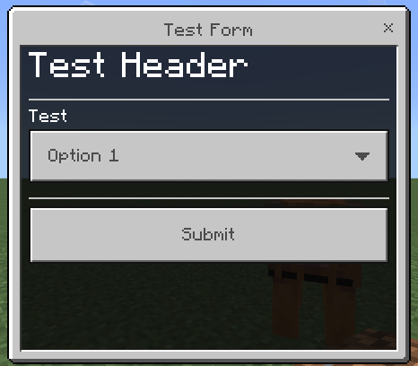

**Effect Generator Form Preview**

**Modal Form v2.0.0-beta features**

@minecraft/server-ui v2.0.0-beta module currently adds [headers](https://jaylydev.github.io/scriptapi-docs/preview/classes/_minecraft_server-ui.ModalFormData-1.html#header), [dividers](https://jaylydev.github.io/scriptapi-docs/preview/classes/_minecraft_server-ui.ModalFormData-1.html#divider), [labels](https://jaylydev.github.io/scriptapi-docs/preview/classes/_minecraft_server-ui.ModalFormData-1.html#label) and more. The following images demostrates those features (subject to change).

> Image from [xKingDark](https://github.com/DarkGamerYT)