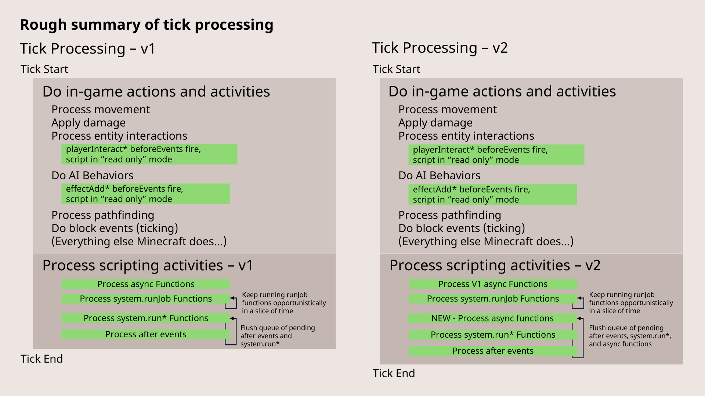

Rough summary of when `system.run`, `system.runJob` and events run.

> Image from [Microsoft Creator Docs](https://learn.microsoft.com/en-us/minecraft/creator/documents/scriptingv2.0.0overview?view=minecraft-bedrock-stable)
