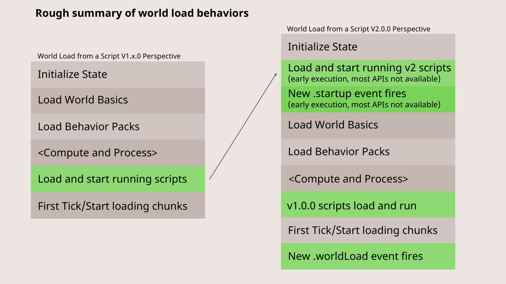

> Image from [Microsoft Creator Docs](https://learn.microsoft.com/en-us/minecraft/creator/documents/scriptingv2.0.0overview?view=minecraft-bedrock-stable)

A video verson available of `worldLoad` event walkthrough is available here (timestamp provided):

<iframe width="914" height="514" src="https://www.youtube.com/embed/owfBDnOHI_o?start=86" title="Script API v2.0.0 Beta Overview" frameborder="0" allow="accelerometer; autoplay; clipboard-write; encrypted-media; gyroscope; picture-in-picture; web-share" referrerpolicy="strict-origin-when-cross-origin" allowfullscreen></iframe>
