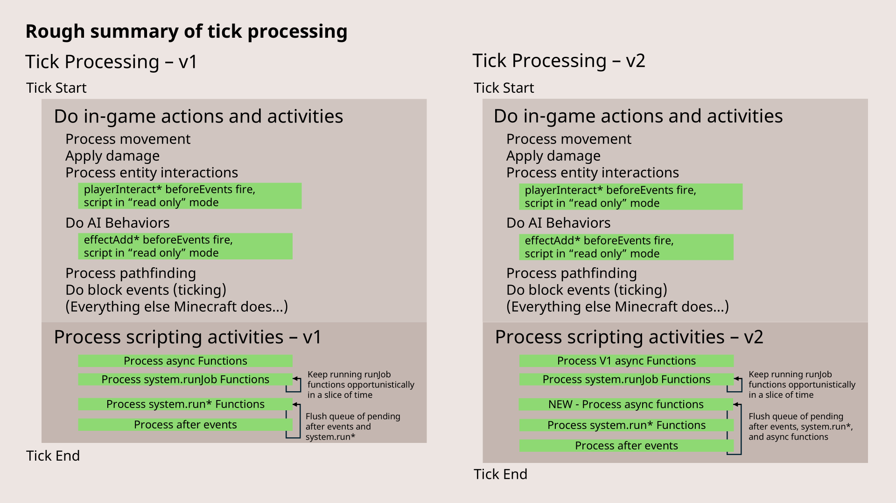

[**Script API - v1.26.10**](../../../README.md)

***

[Script API - v1.26.10](../../../packages.md) / [@minecraft/server](../README.md) / System

# Class: System

A class that provides system-level events and functions.

Rough summary of when `system.run`, `system.runJob` and events run.



> Image from [Microsoft Creator Docs](https://learn.microsoft.com/en-us/minecraft/creator/documents/scriptingv2.0.0overview?view=minecraft-bedrock-stable)

## Source

```ts
export class System {
    private constructor();
    readonly afterEvents: SystemAfterEvents;
    readonly beforeEvents: SystemBeforeEvents;
    readonly currentTick: number;
    readonly isEditorWorld: boolean;
    readonly serverSystemInfo: SystemInfo;
    clearJob(jobId: number): void;
    clearRun(runId: number): void;
    run(callback: () => void): number;
    runInterval(callback: () => void, tickInterval?: number): number;
    runJob(generator: Generator<void, void, void>): number;
    runTimeout(callback: () => void, tickDelay?: number): number;
    sendScriptEvent(id: string, message: string): void;
    waitTicks(ticks: number): Promise<void>;
}
```

## Constructors

### Constructor

> `private` **new System**(): `System`

#### Returns

`System`

## Properties

### afterEvents

> `readonly` **afterEvents**: [`SystemAfterEvents`](SystemAfterEvents.md)

#### Remarks

Returns a collection of after-events for system-level
operations.

This property can be read in early-execution mode.

#### Example

```js
import { system, world, Player } from "@minecraft/server";

// Subscribe to the scriptEventReceive event, which is triggered when a custom script event is received
system.afterEvents.scriptEventReceive.subscribe((event) => {
const { message, sourceEntity } = event;

// Check if the source entity is a player
if (sourceEntity instanceof Player) {
   // If the received message is "hi"
   if (message === "hi") {
       // Get the player's name
       let playerName = sourceEntity.name;

       // Send a greeting message back to the player
       sourceEntity.sendMessage(`hello ${playerName}`);
   }
}
});

/*
Usage:
Run the following command in Minecraft to trigger this script event:

/scriptevent foo:bar hi

This will cause the script to detect the event and respond with a message
"hello [playerName]", where [playerName] is the name of the player who ran the command.
/
```

***

### beforeEvents

> `readonly` **beforeEvents**: [`SystemBeforeEvents`](SystemBeforeEvents.md)

#### Remarks

Returns a collection of before-events for system-level
operations.

This property can be read in early-execution mode.

***

### currentTick

> `readonly` **currentTick**: `number`

#### Remarks

Represents the current world tick of the server.

This property can be read in early-execution mode.

#### Example

```js
import { system, world } from "@minecraft/server";

// A function that will be executed periodically
function looper() {
// Send a message to all players in the world with the current game tick count
world.sendMessage(`Current tick: ${system.currentTick}`);
}

// Define constants for time intervals in ticks
const TICKS_IN_SEC = 20; // 20 ticks per second (Minecraft runs at 20 ticks per second)
const TICKS_IN_20_SECS = TICKS_IN_SEC * 20; // 20 seconds in ticks (20 ticks/second * 20 seconds = 400 ticks)

// Set up the looper function to run every 20 seconds in the game
system.runInterval(looper, TICKS_IN_20_SECS);

/*
Usage:
This script sends a message to all players in the game every 20 seconds,
displaying the current tick count in the Minecraft world.

The message will appear as:
"Current tick: [currentTick]"
where [currentTick] is the current game tick at the time the message is sent.
/
```

***

### isEditorWorld

> `readonly` **isEditorWorld**: `boolean`

#### Remarks

Returns true if this is a world where the editor is
currently loaded, returns false otherwise.

This property can be read in early-execution mode.

***

### serverSystemInfo

> `readonly` **serverSystemInfo**: [`SystemInfo`](SystemInfo.md)

#### Remarks

Contains the device information for the server.

This property can be read in early-execution mode.

## Methods

### clearJob()

> **clearJob**(`jobId`): `void`

#### Parameters

##### jobId

`number`

The job ID returned from [System.runJob](#runjob).

#### Returns

`void`

#### Remarks

Cancels the execution of a job queued via [System.runJob](#runjob).

This function can be called in early-execution mode.

#### Example

```js
import { system, world } from "@minecraft/server";

/**
Variable to hold the job reference for later management
@type {number}
/
let job;

/**
A generator function to continuously monitor if any players are sneaking
@returns {Generator<void, void, void>}
/
function* generatorFunction() {
// Infinite loop to create a long-running task
while (true) {
   // Retrieve the list of all players currently in the world
   let worldPlayers = world.getAllPlayers();

   // If no players are found, stop the job and exit the function
   if (worldPlayers.length === 0) {
       system.clearJob(job); // Clear the running job
       return; // Exit the generator function
   }

   // Iterate over each player in the world
   for (let worldPlayer of worldPlayers) {
       // Check if the player is sneaking
       if (worldPlayer.isSneaking) {
           // Display an alert message on the player's action bar
           worldPlayer.onScreenDisplay.setActionBar("[Alert] You are now sneaking");
       }

       // Pause the generator function until the next game tick
       yield;
   }
}
}

// Create an instance of the generator function
const generator = generatorFunction();

// Start the generator function as a periodic job in the game system
job = system.runJob(generator);
```

***

### clearRun()

> **clearRun**(`runId`): `void`

#### Parameters

##### runId

`number`

#### Returns

`void`

#### Remarks

Cancels the execution of a function run that was previously
scheduled via [System.run](#run).

This function can be called in early-execution mode.

#### Examples

```js
import { system } from "@minecraft/server";

const runId = system.run(() => {
// console.log removed for example clarity
});

// Clear the run, so it will not run again.
system.clearRun(runId);
```

```js
// by WavePlayz

import { system, world } from "@minecraft/server";

/**
@type {number}
/
let interval;

// A function to check if any player in the world is sneaking
function looper() {
// Retrieve all players currently in the world
let worldPlayers = world.getAllPlayers();

// If no players are found, stop the job and exit the function
if (worldPlayers.length === 0) {
   system.clearRun(interval); // Clear the running job
   return; // Exit the generator function
}

// Iterate over each player in the world
for (let worldPlayer of worldPlayers) {
   // If the player is sneaking, display an alert on their action bar
   if (worldPlayer.isSneaking) {
       worldPlayer.onScreenDisplay.setActionBar("[Alert] You are now sneaking");
   }
}
}

// Run the generator function as a periodic job in the game system
interval = system.runInterval(looper);
```

***

### run()

> **run**(`callback`): `number`

#### Parameters

##### callback

() => `void`

Function callback to run at the next game tick.

#### Returns

`number`

An opaque identifier that can be used with the `clearRun`
function to cancel the execution of this run.

#### Remarks

Runs a specified function at the next available future time.
This is frequently used to implement delayed behaviors and
game loops. When run within the context of an event handler,
this will generally run the code at the end of the same tick
where the event occurred. When run in other code (a
system.run callout), this will run the function in the next
tick. Note, however, that depending on load on the system,
running in the same or next tick is not guaranteed.

This function can be called in early-execution mode.

#### Examples

```typescript
import { world, system } from "@minecraft/server";

function trapTick() {
  try {
    // Minecraft runs at 20 ticks per second.
    if (system.currentTick % 1200 === 0) {
      world.sendMessage("Another minute passes...");
    }
  } catch (e) {
    console.warn("Error: " + e);
  }

  system.run(trapTick);
}
```

```js
import { system } from "@minecraft/server";

const runId = system.run(() => {
// console.log removed for example clarity
});
```

***

### runInterval()

> **runInterval**(`callback`, `tickInterval?`): `number`

#### Parameters

##### callback

() => `void`

Functional code that will run when this interval occurs.

##### tickInterval?

`number`

An interval of every N ticks that the callback will be
called upon.

#### Returns

`number`

An opaque handle that can be used with the clearRun method
to stop the run of this function on an interval.

#### Remarks

Runs a set of code on an interval.

This function can be called in early-execution mode.

#### Examples

```typescript
import { world, system, DimensionLocation } from "@minecraft/server";

function every30Seconds(targetLocation: DimensionLocation) {
  const intervalRunIdentifier = Math.floor(Math.random() * 10000);

  system.runInterval(() => {
    world.sendMessage("This is an interval run " + intervalRunIdentifier + " sending a message every 30 seconds.");
  }, 600);
}
```

```js
// by WavePlayz

import { system, world } from "@minecraft/server";

// A function to check if any player in the world is sneaking
function looper() {
// Retrieve all players currently in the world
let worldPlayers = world.getAllPlayers();

// Iterate over each player in the world
for (let worldPlayer of worldPlayers) {
   // If the player is sneaking, display an alert on their action bar
   if (worldPlayer.isSneaking) {
       worldPlayer.onScreenDisplay.setActionBar("[Alert] You are now sneaking");
   }
}
}

// Attach the looper function as interval in the game system
system.runInterval(looper);
```

***

### runJob()

> **runJob**(`generator`): `number`

#### Parameters

##### generator

`Generator`\<`void`, `void`, `void`\>

The instance of the generator to run.

#### Returns

`number`

An opaque handle that can be used with [System.clearJob](#clearjob) to stop the run of this generator.

#### Remarks

Queues a generator to run until completion.  The generator
will be given a time slice each tick, and will be run until
it yields or completes.

This function can be called in early-execution mode.

#### Examples

```typescript
import { system, BlockPermutation, DimensionLocation } from "@minecraft/server";

function cubeGenerator(targetLocation: DimensionLocation) {
  const blockPerm = BlockPermutation.resolve("minecraft:cobblestone");

  system.runJob(blockPlacingGenerator(blockPerm, targetLocation, 15));
}

function* blockPlacingGenerator(blockPerm: BlockPermutation, startingLocation: DimensionLocation, size: number) {
  for (let x = startingLocation.x; x < startingLocation.x + size; x++) {
    for (let y = startingLocation.y; y < startingLocation.y + size; y++) {
      for (let z = startingLocation.z; z < startingLocation.z + size; z++) {
        const block = startingLocation.dimension.getBlock({ x: x, y: y, z: z });
        if (block) {
          block.setPermutation(blockPerm);
        }
        yield;
      }
    }
  }
}
```

```js
// by WavePlayz

import { system, world } from "@minecraft/server";

/**
A generator function to continuously monitor if any players are sneaking
@returns {Generator<void, void, void>}
/
function* generatorFunction() {
// Long running task
while (true) {
   // Retrieve all players currently in the world
   let worldPlayers = world.getAllPlayers();

   // Iterate over each player in the world
   for (let worldPlayer of worldPlayers) {
       // If the player is sneaking, display an alert on their action bar
       if (worldPlayer.isSneaking) {
           worldPlayer.onScreenDisplay.setActionBar("[Alert] You are now sneaking");
       }

       // Pause the generator function until the next game tick
       yield;
   }
}
}

// Create an instance of the generator function
const generator = generatorFunction();

// Run the generator function as a periodic job in the game system
system.runJob(generator);
```

***

### runTimeout()

> **runTimeout**(`callback`, `tickDelay?`): `number`

#### Parameters

##### callback

() => `void`

Functional code that will run when this timeout occurs.

##### tickDelay?

`number`

Amount of time, in ticks, before the interval will be
called.

#### Returns

`number`

An opaque handle that can be used with the clearRun method
to stop the run of this function on an interval.

#### Remarks

Runs a set of code at a future time specified by tickDelay.

This function can be called in early-execution mode.

#### Example

```js
import { TicksPerSecond, system } from "@minecraft/server";

system.runTimeout(() => {
// console.log removed for example clarity
}, TicksPerSecond * 5); // Tick delay of 5 seconds
```

***

### sendScriptEvent()

> **sendScriptEvent**(`id`, `message`): `void`

#### Parameters

##### id

`string`

Identifier of the message to send. This is custom and
dependent on the kinds of behavior packs and content you may
have installed within the world.

##### message

`string`

Data component of the message to send. This is custom and
dependent on the kinds of behavior packs and content you may
have installed within the world.

#### Returns

`void`

#### Remarks

Causes an event to fire within script with the specified
message ID and payload.

#### Throws

This function can throw errors.

[minecraftcommon.EngineError](../../common/classes/EngineError.md)

[minecraftcommon.InvalidArgumentError](../../common/classes/InvalidArgumentError.md)

[NamespaceNameError](NamespaceNameError.md)

#### World Ready

This function can't be called in early-execution mode.

***

### waitTicks()

> **waitTicks**(`ticks`): `Promise`\<`void`\>

#### Parameters

##### ticks

`number`

The amount of ticks to wait. Minimum value is 1.

#### Returns

`Promise`\<`void`\>

A promise that is resolved when the specified amount of
ticks have occurred.

#### Remarks

waitTicks returns a promise that resolves after the
requested number of ticks.

This function can be called in early-execution mode.

#### Throws

This function can throw errors.

[minecraftcommon.EngineError](../../common/classes/EngineError.md)

#### Example

```js
import { Player, system, world } from "@minecraft/server";

// Subscribe to the entityHurt event, which triggers whenever an entity takes damage
world.afterEvents.entityHurt.subscribe(async (eventData) => {
// Extract the hurt entity and damage amount from the event data
const { hurtEntity, damage } = eventData;

// Wait for a number of game ticks equal to the damage value before proceeding
await system.waitTicks(damage);

// Attempt to get the health component of the hurt entity
const health = hurtEntity.getComponent("health");

// If the entity has a health component, reset its health to the maximum value
if (health != null) {
   health.resetToMaxValue(); // Reset the entity's health to full

   // Send a message to the entity (if it supports receiving messages)
   if (hurtEntity instanceof Player) {
       hurtEntity.sendMessage("Health reset");
   }
}
});
```
